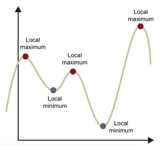
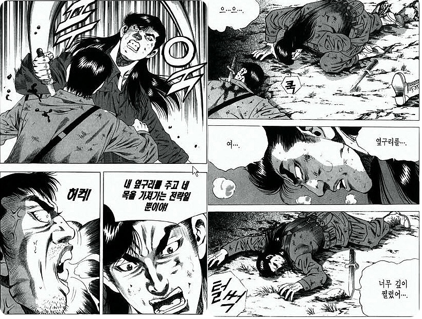
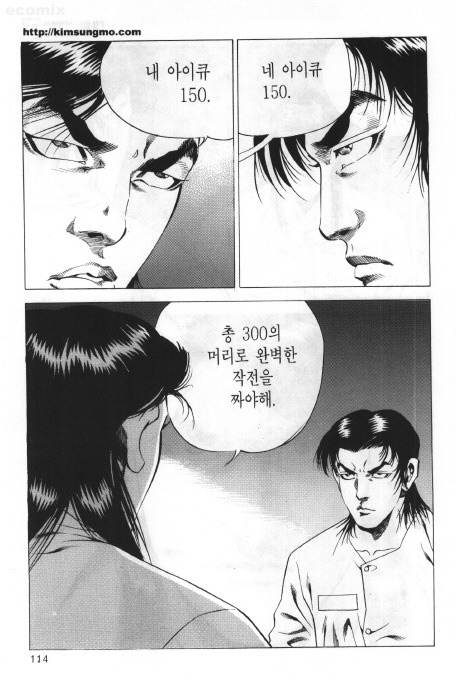

# P-Stage 개인 회고록

## 대회의 개요 요약

- 데이터 : 인물 사진
- 출력값: 마스크 착용 여부(착용, 잘못된 착용, 미착용), 성별(남자, 여자), 나이(30살 이하, 30 부터60, 60 이상)을 고려한 18개의 클래스중 하나
- 위를 만족하는 모델을 만들어 제출 하여 F1 점수로 등수를 나눔
- 총 2주에 걸쳐서 진행되고 1주는 개인, 2주 이후에는 팀으로 진행됨

## 시간별 회고

## 1주차

- 처음 대회의 데이터와 모델로 부터 무엇을 예측하게 해야 하는지 들은 순간부터 마스크 착용 여부, 성별, 나이를 예측하는 모델 세개를 만든 후에 합치면 된다고 생각했다.
    1. EDA를 하기도 전에 저렇게 생각한 이유는 2700명의 사진으로는 18개의 클래스를 분리하는 모델을 만들기에는 그 수가 부족했던 이유가 크다
- 바로 모델을 만들려고 시도를 해봤지만 리눅스 환경에 익숙하지 않아 모델링, 데이터 전처리보다는 환경 설정에 더 애를 먹었던 것 같다.
- 어찌저찌 환경을 구축한 후에 주피터 노트북으로 모델링을 하고 학습시키고 결과를 제출했고 두어번 만에 0.73정도로 3등까지 도달했던 것 같다.
    1. 이때 까지만 해도 어떤 backbone 모델을 잘 골라야 하겠다는 생각에 차 있었다.
    2. 하지만 지금 와서 생각해보면 이는 **매우매우매우** 어리석은 생각이었는데 모델을 세개로 나눴던 이유 자체가 **데이터가 부족**해서 였던 것을 생각해보면 크고 복잡한 모델을 찾는 것 보다는 실험을 빠르게 할 수 있는 작은 모델들을 찾고 고정한 후에 다른 패러미터들을 찾는 것이 정답이었던 것 같다.
    3. 이 생각 자체는 1주차 막바지에도 어느정도 했었는데 이 생각에 확신을 가지지 못하고 그래도 혹시? 하는 생각으로 이 모델 저 모델 건드려봤던게 후술할 2주차에서 점수를 올리지 못했던 주요 요인이라고 생각한다.
- 모델의 학습에서 학습률이 낮으면 로컬미니마에 빠져 나오지 못하는 경우가 있듯이 초반의 성과에 생각의 로컬 미니마에 빠진것 같다. 물론 당시에는 알지 못했다

빠져 버리고 말았다... 생각의 로컬 미니마

- 사실 엄밀이 따지면 빨리 제출해서 좋았던 것이지 결코 잘해서 낸 성과가 아니었다.

## 2주차

- 여기서부터는 실패의 연속이라고 생각한다. (마지막 1초 빼고...)
- 파이토치 템플릿은 모듈화가 잘되있어 유지 보수가 용의하고 패러미터도 json 형식으로 받아 여러 실험을 하기 좋은 **훌륭한 베이스라인** 이었다.
- 하지만 반대로 무언가 처음으로 시도할 경우 잘 짜여진 모듈화에서 내 실력으로는 자유롭게 실험을 하지 못했다. 반대로 실력만 좋았으면 해당 템플릿에서 이것저것 다양한 시도를 할 수 있었겠지만 이 코드 수정하고 저 코드 수정하고 하다보면 어디서 에러가 나는지 추적하는 것이 매우 큰 일이었다.
    1. 여기서 나는 결단을 하는데 주피터로 실험을 해서 결과를 낸 다음에 템플릿에 적용하면 되는거 아닌가? 라는 생각으로 템플릿에서 벋어나 주피터로 실험을 하게 되었다.
    2. 생각 자체는 지금도 좋다고는 생각하지만 문제는 위에서 언급한 생각에 로컬 미니마에 빠져 버려서 backbone 모델을 찾는다거나 Augmention을 줄때 모델도 함께 바꿔서 통제변인을 제대로 설정 못해서 성능에 영향을 주는 요인 탐색을 제대로 하지 못했다. ( 기초물리실험 수업 때 당시 조교님들이 그렇게 중요하다고 한 이유가 있었다... 물론 학부 1년때의 시간은 너무 과거긴 하지만..)
    3. 2의 결과 제대로된 실험은 커녕 의미없이 시간만 축냈고 팀플레이는 커녕 개인 플레이도 제대로 하지 못했던 것 같다. 게임으로 비유하자면 LOL에서 라인전 망하고 "아 내가 캐리함" 하면서 사이드 돌다가 계속 짤려서 죽는.... 그런 그림이 나온것 같다.

템플릿을 포기하고 실험을 가져가는 전략이었으나 실험이 망해버리고 말았다....

- 부족한 데이터를 보완하기 위한 Augmentation도 Crop된 이미지를 미리 저장한다거나, HorizonFlip도 고정적으로 주기위해 저장(즉 HardAugmentation)해서 사용했는데 이걸 진작 Soft말고 Hard로 했었어야 했고 이성적으로 따지면 당연한 생각인데 왜 그걸 안했는지는 지금도 잘 이해가 가지 않는다.
- Cutout은 어차피 테스트 데이터가 노이즈 낀게 없고 마스크 부분을 잘라내 버리면 성능 저하가 올 수 있을 것 같아서(왜? 이렇게 생각했을까?) 실험도 안해보고 사용하지 않기로 단정지어버려 시도를 별로 하지 않았는데, 애초에 문제는 학습을 못하는게 아니라 일반화였으니 했었어만 했다.
- 실패담만 이야기 했지만 그래도 좋았던 것은 마지막에 앙상블을 통한 비약적인 성능 향상을 했다는것이다. 그것도 제출 1초전에....(영화의 한 장면이었다.)

언제나 옳은 말만 하시는 만신 김성모 작가님...

- 앙상블의 경우 개별 모델의 성능이 별로 나오질 않아서 시도 안하고 있었는데 지금 곰곰히 생각해보면 상위권과의 F1 스코어가 0.0x 로 갈리고 있는 상황에서는 개별 성능이 나오지 않는다고 시도를 안한게 늦게 적용한 이유였다. 상황마다 다르겠지만 0.73 정도면 개별 모델로는 성과가 나오기 충분했고 0.0x를 매꾸기 위해 앙상블을 적용하는 것이었다. 나는 0.76을 개별 성능의 기준점으로 생각했는데 잘못된 판단이었다.

# 그래서? 앞으로는?

- 우선 이론 공부를 짧게라도 복습해야겠다. 상위권 발표자료들을 보니 특별한 것을 한게 아니었다. 기본기에 충실했을 뿐, 내가 배웠는데 아 저거! 하던것들도 있었다. 다시 깊게 공부하는건 시간 낭비인것 같고 빠르게 키워드만이라도 제대로 복습해야겠다.
- 깃허브 익숙해지기
    1. 아무래도 협업에서 중요한 요인중 하나는 깃이지만 아직 익숙하지 못해서 힘들었던 점도 많았다. 템플릿에서 벋어나 주피터로 한 이유중 하나가 코드 충돌이라던가 pull이 안된다거나 해서 그냥 주피터에서 복붙해야지 했던 것들인데 익숙했다면 조금은 덜 하지 않았을까 생각해본다.
    2. 단순 깃에 익숙해지는 것 외에도 문서화를 잘해서 남들도 내 실험을 재현할 수 있게 해야겠다.
- 실험의 설계를 잘하기
    1. 실험을 하는데 통제변인(하이퍼 패러미터, 데이터 등등)을 고정할 건 고정하고 바꿀건 바꾸고 해서 했어야 했는데 너무 난잡했다. 실험의 실패요인중 하나
    2. 실험 결과 공유가 잘 안됬던 이유중 하나가 잘못된 설계 때문에 서로 같은 실험을 했는데도 결과가 다르게 보이는듯한 현상(서로 완벽하게 같은 상황이 아니었다.)이 큰 이유중 하나라고 생각한다.
- 템플릿(베이스라인) 익숙해지기
    1. 이번에 사용한 템플릿은 분명 좋은 코드였다. 하지만 익숙치 않아서, 제대로 코드를 작성하지 못해서 실험에 한정적인 부분이 분명 있었다. 이건 내가 익숙해지고 코드를 잘 모듈화해서 작성하면 해결될 일이므로 내가 맞춰가는게 맞다는 생각이 든다.
    2. 다음 대회에서 베이스 라인이 주어지는지는 모르겠는데 주어진다고 해도 이미 깃에 있는 템플릿 코드이므로 주어지는 베이스라인 말고 템플릿으로 팀원들과 빠르게 실험해보는게 좋을 것 같다.

# 다음 목표

이번에 개인적으로 좋은 성능을 냈으면 tip 게시판, 토론 게시판등에 글을 올려보고 싶었지만 그러지 못했다. 다음 대회에는 꼭 성능을 내서 조원 뿐만 아니라 캠퍼 모두에게 도움이 되는 사람이 되고 싶다.